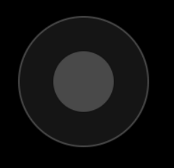

# PureJoyJS
Virtual joystick with delegate function for JavaScript.

A simple, touch-friendly virtual joystick written in pure JavaScript, utilizing HTML Canvas for drawing and Pointer Events for input handling.

It's great for touch controls because it leverages the modern Pointer Events API, which unifies input from mouse, touch, and pen. This ensures a reliable and responsive experience across mobile devices, tablets, and even desktops with touchscreens, making it an ideal choice for implementing virtual game controls.

```
const joystick = new Joystick('left_stick', handleJoystickInput, joystickSize);
joystick.placeJoystickAt(xPosition, yPosition, zDepth);

function gameLoop() {
    // Update game logic here...
    joystick.draw();
}
```



Live Demo:
https://demensdeum.com/software/cube-art-project-2-online/
